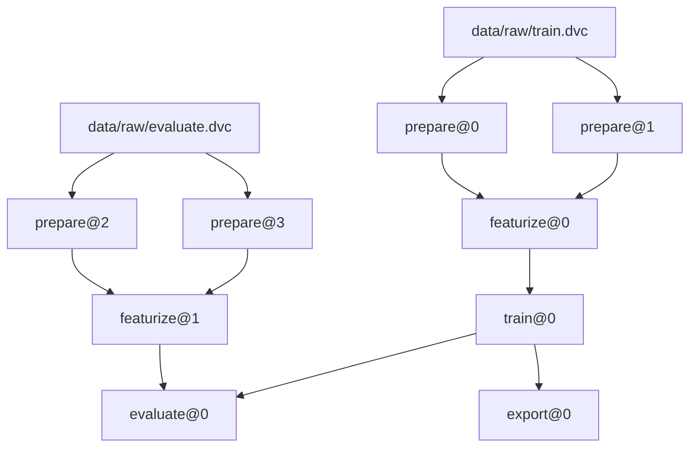

# Image ranking model training 

## Background
Manually editing photos is time-consuming and labor-intensive. By training a model to score images based on running style, this project aims to streamline the post-processing workflow for photography.

## About
This project uses training data where images of running individuals are cropped and split into lower and upper body segments during the preparation stage. The model predicts running style based on leg movements, scoring the style on a scale from 0.0 (poor) to 1.0 (excellent).

## Version Control
This project uses `dvc` to version control the dataset, models, parameters, and code. This ensures that any stage of the model can be reproduced if needed.

## Visualize the DVC Workflow

The system is divided into two pipelines: the training pipeline and the evaluation pipeline. The evaluation pipeline depends on the training pipeline. The reason for having two separate pipelines is that they use different raw data for processing. The `export` stage is where the training model is exported into portable model such as `.onnx` format.

```
$ uv run dvc dag --mermaid
```



## Managing data/*

### Example - adding new image to data/raw

```
# Adding the new image
cp my_new_image.jpg data/raw/train/lower_body/bad/

# Re-run pipeline to generate dvc.lock (see changes)
uv run dvc repro

# Stage and commit updated version
git add dvc.lock
git commit -m "Add new image to data/raw"
uv run dvc push
```

## API Documentation

The project includes an API for ranking images based on running style. The API is built using FastAPI and provides endpoints for processing images and retrieving rankings.

### Running the API Locally
To start the API server, run:
```
cd apps/api && uv run python -m src.api.run
```
See the API documentation here: `http://localhost:8000/docs`.

**Note:** Ensure that you have run the training pipeline with relevant training data before starting the API. The model required for ranking images is still under development and may not be available at this moment.

## Development

Refer to the `justfile` for various development commands. To install dependencies and set up the environment, run:
```
just setup
```

For testing, use:
```
just test
```

For linting and formatting, use:
```
just lint
just fix
```

# TODO
- [ ] Collect images into a dataset where people have hands above their head. If they do, the image should get extra points.
- [ ] Create API endpoint that accept a image (base64) and extracts the lower body of the pseron from the image if exists and return the represented base64 string.
